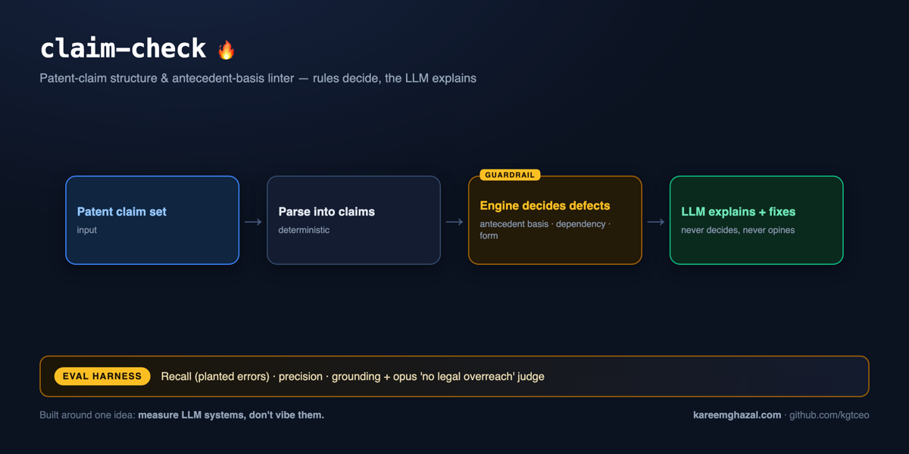

# claim-check

A **patent-claim structure & antecedent-basis linter**. Paste a claim set; a **deterministic engine**
decides the structural defects a drafter must not get wrong, and the **LLM only explains** each one and
suggests a fix — it never decides a defect and never opines on legal outcomes. Ships an eval harness.

> Built around one idea: **measure LLM systems, don't vibe them.** The clinical/patent-grade version of
> that idea: *never let the model hallucinate the fact.* Here the facts are decided in code.

**Educational — a heuristic linter, not legal advice.**



## What it checks (the engine decides — no LLM)

- **Antecedent basis** — the classic §112 defect: a definite reference (`the X` / `said X`) with no
  earlier introduction (`a X` / `an X` / `at least one X`) in the claim or its dependency chain.
- **Claim dependency** — a dependent claim that references a later, non-existent, or its own claim number.
- **Single-sentence rule** — a claim written as more than one sentence.
- **Indefiniteness (advisory)** — relative terms of degree (`substantially`, `about`, `preferably`…)
  that may draw a §112(b) objection — flagged for a human to judge, not asserted.

Element detection is a controlled **token-walk** (not greedy regex): after an article it takes the
noun-phrase head up to a stop word or a participle, and matches an element by its head (so `the
assembly` matches an introduced `a widget assembly`, and a trailing verb like `the core **shares** a
cache` doesn't derail it). It's deliberately conservative — skips patent boilerplate and stays quiet on
a claim whose dependency is already broken — to avoid crying wolf.

The **LLM never decides a finding**. It only turns each decided finding into a plain-English
explanation + a concrete wording fix, mapped back by index so it can't add or drop findings.

## Quickstart

```bash
pip install -e .
cp .env.example .env   # add ANTHROPIC_API_KEY

claim-check demo                       # run on a built-in sample
claim-check demo --no-llm              # deterministic engine only (no API key)
claim-check check --file my_claims.txt
echo "1. A device comprising a processor coupled to the controller." | claim-check check
```

## Evals

The engine is the product, so the headline gates need **no API key**:

```bash
python evals/run_evals.py            # deterministic gates (recall / precision / grounding)
python evals/run_evals.py --judge    # + LLM explanations + an opus faithfulness judge
```

- **Recall** — every planted structural error (antecedent basis / dependency / single-sentence) is caught.
- **Precision** — clean claim sets stay quiet; no error beyond the planted set.
- **Grounding** — every finding's span really appears in its claim text (no fabricated quotes).
- **Judge** (opus) — the explanations are *faithful* to the findings, *actionable*, and stay drafting
  assistance (no legal-outcome opinions).

**Latest run (claude-sonnet-4-6, opus judge):** all gates pass — **5/5 planted errors caught**,
clean sets silent, all findings grounded, and the opus judge confirms every explanation is faithful,
actionable, and free of legal overreach. Notably the judge originally **caught the model overreaching**
(predicting examiner rejections, escalating a single-sentence issue to "indefinite") — the explainer
prompt was then constrained so it stays strictly drafting-assistance. That's the eval doing its job.

## Tests

```bash
pytest -q   # offline: parsing, antecedent basis, dependency, cascade-suppression, indefiniteness
```

## Web

`web/` — a Next.js UI: paste claims, see each finding pinned to its claim with an explanation and a fix.
Run it locally in two terminals:

```bash
# terminal 1 — the API
pip install -e .
cp .env.example .env                  # add ANTHROPIC_API_KEY
python -m uvicorn claim_check.api:app --port 8000

# terminal 2 — the UI
cd web
npm install
echo "NEXT_PUBLIC_API_URL=http://localhost:8000" > .env.local
npm run dev                           # open http://localhost:3000
```

To deploy (Railway for the API, Vercel for `web/`), see [DEPLOY.md](./DEPLOY.md).

## License

MIT — see [LICENSE](./LICENSE). Educational; not legal advice.
