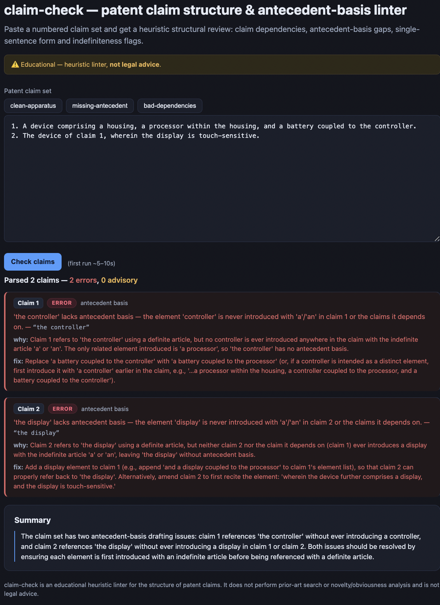

# claim-check

### ▶ Live demo: **[claim-check.kareemghazal.com](https://claim-check.kareemghazal.com)**

[](https://github.com/kgtceo/claim-check/actions/workflows/ci.yml)

A **patent-claim structure & antecedent-basis linter**. Paste a claim set; a **deterministic engine**
decides the structural defects a drafter must not get wrong, and the **LLM only explains** each one and
suggests a fix — it never decides a defect and never opines on legal outcomes. Ships an eval harness.



> Built around one idea: **measure LLM systems, don't vibe them.** The clinical/patent-grade version of
> that idea: *never let the model hallucinate the fact.* Here the facts are decided in code.

**Educational — a heuristic linter, not legal advice.**


## What it checks (the engine decides — no LLM)

- **Antecedent basis** — the classic §112 defect: a definite reference (`the X` / `said X`) with no
  earlier introduction (`a X` / `an X` / `at least one X`) in the claim or its dependency chain.
- **Claim dependency** — a dependent claim that references a later, non-existent, or its own claim number.
- **Single-sentence rule** — a claim written as more than one sentence.
- **Indefiniteness (advisory)** — relative terms of degree (`substantially`, `about`, `preferably`…)
  that may draw a §112(b) objection — flagged for a human to judge, not asserted.

Element detection is a controlled **token-walk** (not greedy regex): after an article it takes the
noun-phrase head up to a stop word or a participle, and matches an element by its head (so `the
assembly` matches an introduced `a widget assembly`, and a trailing verb like `the core **shares** a
cache` doesn't derail it). It's deliberately conservative — skips patent boilerplate and stays quiet on
a claim whose dependency is already broken — to avoid crying wolf.

The **LLM never decides a finding**. It only turns each decided finding into a plain-English
explanation + a concrete wording fix, mapped back by index so it can't add or drop findings.

## Quickstart

**Requirements:** Python ≥3.10 (backend) · Node ≥18 (the `web/` UI). The deterministic engine, tests
and eval gates need no API key.

```bash
python -m venv .venv && source .venv/bin/activate
pip install -e .
cp .env.example .env   # add ANTHROPIC_API_KEY

claim-check demo                       # run on a built-in sample
claim-check demo --no-llm              # deterministic engine only (no API key)
claim-check check --file my_claims.txt
echo "1. A device comprising a processor coupled to the controller." | claim-check check
```

## Evals

The engine is the product, so the headline gates need **no API key**:

```bash
python evals/run_evals.py            # deterministic gates (recall / precision / grounding)
python evals/run_evals.py --judge    # + LLM explanations + an opus faithfulness judge
```

- **Recall** — every planted structural error (antecedent basis / dependency / single-sentence) is caught.
- **Precision** — clean claim sets stay quiet; no error beyond the planted set.
- **Grounding** — every finding's span really appears in its claim text (no fabricated quotes).
- **Judge** (opus) — the explanations are *faithful* to the findings, *actionable*, and stay drafting
  assistance (no legal-outcome opinions).

Every run writes a **reproducible artifact** to [`evals/results/latest.json`](evals/results/latest.json)
— per-case outcomes, the models used, and a timestamp. The numbers below come from that file.

**Latest run (claude-sonnet-4-6 explainer, opus judge):** all gates pass — **7/7 planted errors
caught**, clean sets silent (including a **real granted claim set**, below), all findings grounded,
and the opus judge passes every explanation as faithful, actionable, and free of legal overreach.

**The judge has now caught the model twice** — both true stories, both fixed by tightening the
explainer prompt: (1) it originally **overreached** (predicting examiner rejections, escalating a
single-sentence issue to "indefinite") → constrained to strict drafting-assistance; (2) it later
produced a **non-actionable fix** — for "the identified sensor" it suggested introducing "a sensor",
silently dropping "identified" — → the fix must now quote and correct the claim's exact language.
That's the eval doing its job: deterministic gates can't see either failure.

**Tested on real granted claims.** Running claims 1-3 of **US 6,285,999 (Google's PageRank patent,
granted 2001, expired)** through an earlier engine produced **10 false positives** — every one a
standard drafting convention the rules didn't model: the dependent-claim preamble ("The method of
claim 1"), gerund references to method steps ("the assigning"), quantifier phrases ("the one or
more linking documents"), leading past-participles ("the identified weighting factor"), and a
mid-phrase participle hiding the intro's head noun ("A computer implemented method"). Each is now
an explicit engine rule with its own unit test, negative controls prove the rules don't swallow
real defects (a gerund with no step and a participle with no base element still flag), and the
PageRank set is a permanent clean regression case in both the test suite and the eval set.

The set is **10 hand-labelled claim sets** — 3 clean (including the real PageRank claims) and 7 with
a planted defect (missing antecedent basis in an independent and a dependent claim, a forward
dependency, a self-reference, a multi-sentence claim, a gerund with no step, and a participle with
no base element). It's enough to gate the engine's behaviour on each defect type, not a benchmark;
add your own — each case is one JSON object in `evals/dataset/cases.json`:

```json
{ "name": "my-case",
  "claims": "1. A device comprising a widget coupled to the controller.",
  "expect_errors": [{ "claim_number": 1, "kind": "antecedent_basis" }] }
```

`kind` is one of `antecedent_basis` · `dependency` · `single_sentence` · `indefiniteness`; use
`"expect_errors": []` for a clean claim set.

## Limitations (what it does NOT do)

- It's a **heuristic linter**, not a legal determination. Noun-phrase detection is rule-based (a
  controlled token-walk), so unusual or very long claim phrasing can miss or over-flag an element —
  always have a human confirm.
- Antecedent basis is resolved within a claim and its dependency chain; **deeply nested or unusual
  multiple-dependent chains** are approximated.
- It expects **conventionally-formatted, numbered claims** (US/EPO drafting style); non-standard
  formatting may parse imperfectly.
- It covers claim **formalities** — antecedent basis, claim dependency, single-sentence form, and
  relative-term (§112(b)) flags (the last is advisory). It says **nothing** about novelty, obviousness,
  enablement, or substantive patentability.

## Tests

```bash
pytest -q   # offline: parsing, antecedent basis, dependency, cascade-suppression, indefiniteness
```

## Web

`web/` — a Next.js UI: paste claims, see each finding pinned to its claim with an explanation and a fix.
Run it locally in two terminals:

```bash
# terminal 1 — the API
pip install -e .
cp .env.example .env                  # add ANTHROPIC_API_KEY
python -m uvicorn claim_check.api:app --port 8000

# terminal 2 — the UI
cd web
npm install
echo "NEXT_PUBLIC_API_URL=http://localhost:8000" > .env.local
npm run dev                           # open http://localhost:3000
```

To deploy (Railway for the API, Vercel for `web/`), see [DEPLOY.md](./DEPLOY.md).

**Cost / infra:** the deterministic engine, the offline tests, and the eval gates need **no API key
and no spend** — only the LLM *explanations* call the Anthropic API (a few cents per run on Sonnet).
Railway + Vercel free tiers are enough to host the live demo.

## License

MIT — see [LICENSE](./LICENSE). Educational; not legal advice.
